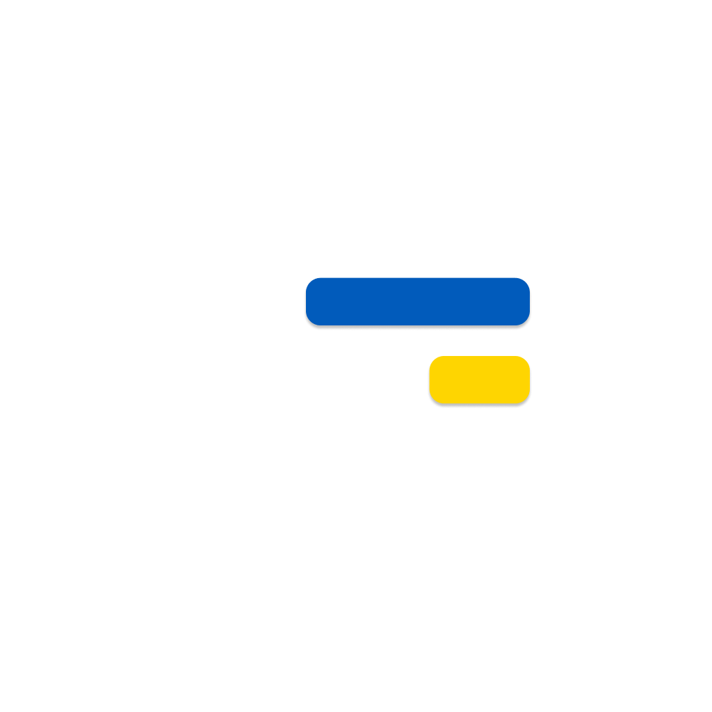

## Add, Download & Install


**Automatically** installs software from a predefined package. Designed for people. 

### Features:
* Works with different systems. 
* User-friendly interface. [](#credits)
* A website and a desktop application.
* Offline mode. [](#credits)
* Installation Options: BAT or EXE. [](#credits)


---------
# Introduction


### Stages 
* [Dependencies installation](#dependencies-installation-)
* [Frontend introduction](#frontend-introduction)
* [Backend introduction](#backend-introduction)
---
## Dependencies installation [](#credits)
### Node.js installation
Install [Node.js](https://nodejs.org/en/download). After installation, check if `npm` and `npx` are working. If they don't work, check these posts to figure it out: 
* [Reddit](https://www.reddit.com/r/node/comments/1h6wer2/npm_not_working_on_windows_after_install_and/),
* [Stackoverflow](https://stackoverflow.com/questions/19569990/npm-install-doesnt-work-in-windows-powershell).


### Expo installation via [`npm`](https://nodejs.org/en/learn/getting-started/an-introduction-to-the-npm-package-manager)
Before [Expo](https://expo.dev/) installing **you need to ensure that your working folder is set to ./frontend**. 
Otherwise, npm won't install correctly. To fix that you need to change your current destination. You can do it by using this command in the terminal.
[](#credits)
```bash
cd ./frontend
```

And finally install [Expo](https://expo.dev/) by using this command:
```bash 
npm install expo
``` 
After this actions project should work.

## **Frontend introduction**
First of all you have to change your working directory by using this command:
```bash
$ cd ./frontend/
```
Then use this command to start frontend 
```bash
$ npx expo start -c
```
[](#credits) If have some problems return to step [Dependencies Installation](#dependencies-installation-)

## **Backend introduction**
[](#credits)


----
# Credits
[](#credits) — This badge highlights really important information.

[](#credits) — This badge indicates items or features coming soon.

### Stack
* [Node.js](https://nodejs.org/en/download), 
* [Expo](https://expo.dev/), 
* [FastAPI](https://fastapi.tiangolo.com/), 
* [Poetry](https://python-poetry.org/).
